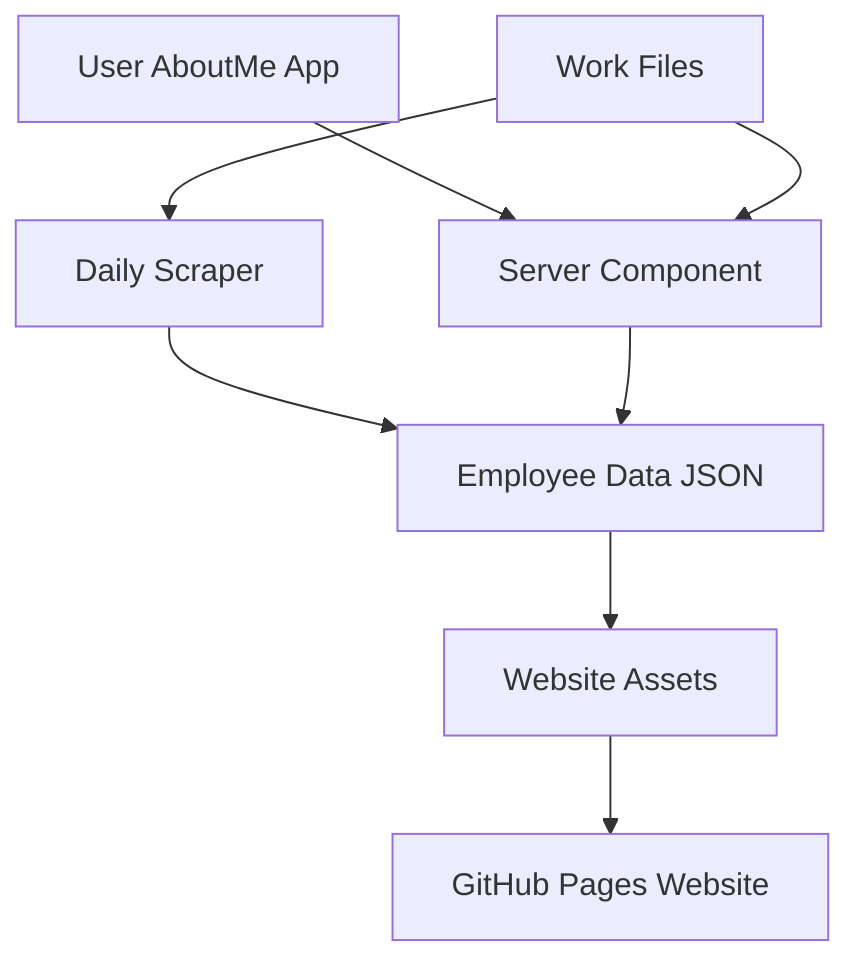

# EmployeeData Repository Architecture

This repository is organized into 5 distinct components for a complete employee data management system.

## 🏗️ Repository Structure

```
EmployeeData/
├── 1-website/           # Main website (GitHub Pages)
├── 2-scraper/           # Daily data collection
├── 3-aboutme/           # User computer data collection
├── 4-server/            # POST data handler
├── 5-workfiles/         # Reference materials
└── .github/             # GitHub Actions workflows
```

## 📋 Component Overview

### 1. Website Component (`1-website/`)
**Purpose**: Main website hosted on GitHub Pages
- **Files**: `index.html`, `assets/` (images, JSON, CSS, JS)
- **Function**: Dynamic website that loads employee data from JSON
- **Features**: 
  - Employee directory with search/filter
  - Computer data collection display
  - Responsive design
  - Real-time data loading

### 2. Scraper Component (`2-scraper/`)
**Purpose**: Daily data collection at midnight
- **Files**: `src/` (scraper code), `daily_scraper.py`
- **Function**: Collects employee data and profile images
- **Schedule**: Runs daily via GitHub Actions
- **Output**: Updates `employees_data.json` and downloads images

### 3. AboutMe Component (`3-aboutme/`)
**Purpose**: User local computer data collection
- **Files**: `about_me.py`, `README.md`
- **Function**: Collects hardware info and sends to server
- **Usage**: Users run locally to submit computer data
- **Output**: Sends data via POST to server component

### 4. Server Component (`4-server/`)
**Purpose**: Handle POST data from AboutMe app
- **Files**: `server.py`, `requirements.txt`
- **Function**: Receives computer data and merges with employee data
- **API**: RESTful endpoints for data submission
- **Output**: Updates employee JSON with computer info

### 5. Work Files Component (`5-workfiles/`)
**Purpose**: Reference materials and documentation
- **Files**: Excel files, reference scripts, documentation
- **Function**: Contains HR data, reference materials
- **Usage**: For data processing and reference

## 🔄 Data Flow



## 🚀 Setup Instructions

### 1. Website Setup
```bash
cd 1-website
# Deploy to GitHub Pages
# Ensure assets/employees_data.json exists
```

### 2. Scraper Setup
```bash
cd 2-scraper
pip install -r requirements.txt
python daily_scraper.py
```

### 3. AboutMe Setup
```bash
cd 3-aboutme
pip install requests psutil wmi
python about_me.py --send-to-github --github-token YOUR_TOKEN
```

### 4. Server Setup
```bash
cd 4-server
pip install -r requirements.txt
python server.py
```

## 🔧 Configuration

### Environment Variables
- `GITHUB_TOKEN`: For API access
- `REPO_OWNER`: GitHub repository owner
- `REPO_NAME`: Repository name

### GitHub Actions
- **Daily Scraper**: Runs at midnight UTC
- **Website Deploy**: Updates on data changes
- **Computer Data Handler**: Processes incoming data

## 📊 Data Files

### Employee Data (`assets/employees_data.json`)
```json
[
  {
    "human_name": "John Doe",
    "email": "john@ennead.com",
    "position": "Architect",
    "office_location": "New York",
    "computer_info": {
      "computername": "JOHN-LAPTOP",
      "os": "Windows 11",
      "cpu": "Intel i7",
      "last_updated": "2025-01-01T00:00:00"
    }
  }
]
```

### Computer Data (`assets/computer_data/all_computers.json`)
```json
[
  {
    "timestamp": "2025-01-01T00:00:00",
    "computer_name": "JOHN-LAPTOP",
    "user": "John Doe",
    "data": {
      "Computername": "JOHN-LAPTOP",
      "OS": "Windows 11",
      "CPU": "Intel i7-13700K"
    }
  }
]
```

## 🎯 Key Features

### Dynamic Website
- Loads data from JSON files
- Real-time search and filtering
- Responsive design
- Computer data integration

### Automated Data Collection
- Daily employee data scraping
- User-submitted computer data
- Automatic data merging
- GitHub integration

### Scalable Architecture
- Modular components
- Clear separation of concerns
- Easy maintenance
- Extensible design

## 🔍 Usage Examples

### Collect Employee Data
```bash
cd 2-scraper
python daily_scraper.py
```

### Submit Computer Data
```bash
cd 3-aboutme
python about_me.py --send-to-github --github-token YOUR_TOKEN
```

### Start Server
```bash
cd 4-server
python server.py
```

### View Website
Open `1-website/index.html` in browser

## 📝 Notes

- Website is purely static (no server-side processing)
- All data is stored in JSON files
- GitHub Actions handle automation
- Computer data is merged into employee records
- Images are stored in `assets/images/`

## 🛠️ Maintenance

### Daily Tasks
- Scraper runs automatically
- Data is updated automatically
- Website reflects latest data

### Weekly Tasks
- Check data quality
- Review computer data submissions
- Update reference materials

### Monthly Tasks
- Clean up old data
- Update documentation
- Review system performance
